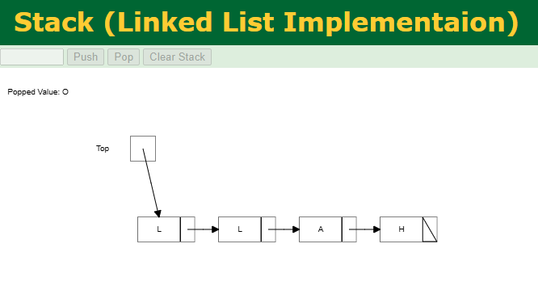

# Präsentation: Stack in C  
_Gruppenarbeit – Programmiertechnik B_

---

# Agenda  

1. **Manuel Näf**  
   - Einführung: Definition, Aufbau, Funktionsweise  
   - Beispiele & Alltagsvergleiche  
   - Übergang zu den Operationen  

2. **Cristian Cubas**  
   - Grafische Darstellung des Aufbaus  
   - Erklärung der Operationen (Push, Pop, Peek)  
   - Visuelle Beispiele  

---

3. **Manuel Näf**  
   - Vor- und Nachteile  
   - Einsatzbereiche  
   - Implementierung in C

4. **Cristian Cubas**
   - Quiz  

---

# Teil 1 – Manuel Näf  

---

# Stack – Einführung  

<!-- presenter notes
Hallo zusammen, ich beginne mit der Einführung in die Datenstruktur Stack. 
Bevor wir uns die Operationen anschauen, möchte ich die Grundidee, den Aufbau 
und Alltagsbeispiele erklären. Das ist die Basis für die nächsten Teile.
-->

---

## Definition: Stack  

- **Stack** (dt. *Stapel*) ist eine abstrakte Datenstruktur  
- Prinzip: **LIFO** = *Last In, First Out*  
- Vergleich: **Tellerstapel**  
  - Letzter Teller oben → erster Teller wieder weg  

<!-- presenter notes
Ein Stack – auf Deutsch Stapel – ist eine abstrakte Datenstruktur. 
Das zentrale Prinzip ist LIFO – Last In, First Out. 
Das heißt, das letzte Element, das hineingelegt wird, 
ist auch das erste, das wieder hinauskommt. 
Wie bei einem Tellerstapel: ich lege Teller oben ab, 
und nehme beim Abheben wieder den obersten.
-->

---

## Prinzip LIFO  

- **Letztes hinein → erstes hinaus**  

Beispiel:  
1. Karten A, B, C werden gestapelt  
2. Reihenfolge: `[A, B, C]`  
3. Erste Entnahme = **C**  

<!-- presenter notes
Ein Beispiel: Ich lege die Karten A, B und C auf den Stapel. 
C liegt oben, A ganz unten. 
Wenn ich jetzt ein Element herausnehme, bekomme ich nicht A, 
sondern C – also das letzte, das ich hineingelegt habe.
-->

---

## Aufbau & Funktionsweise  

- Zwei typische Implementierungen:  
  - **Array-basiert** → feste Größe  
  - **Verkettete Liste** → flexibel, dynamisch  

- Wichtige Bestandteile:  
  - **Speicherbereich** (Array/Liste)  
  - **`top`-Zeiger** → zeigt auf oberstes Element  

<!-- presenter notes
Es gibt zwei klassische Implementierungen: 
Array-basiert – das ist schnell, aber hat eine feste Größe. 
Oder mit einer verketteten Liste – das ist flexibel, kann aber 
etwas mehr Speicher brauchen. 
Wichtig ist immer der Zeiger auf das oberste Element – top – 
denn dort passieren alle Operationen.
-->

---

## Beispiele aus dem Alltag  

- **Tellerstapel**  
- **Browser-History**  
- **Undo-Funktion**  
- **Wäschekorb**  

---

# Teil 2 – Cristian Cubas  

---

## Grafische Skizze  

Stack (Array):
```
Index:   0   1   2   3   4
Werte:  [H][A][L][L][O]
                     ↑ Top


Stack (Linked List):

Top → [O] → [L] → [L] → [A] → [H] → NULL
```
---

## Operation: Push  
```
void push(int value) {
    if (top == SIZE - 1) {
        printf("Stack Overflow!\n");
    } else {
        stack[++top] = value;
    }
}


Push: Legt ein neues Element oben auf den Stack.
Push('O') bei [H][A][L][L] → wird [H][A][L][L][O]
Wenn voll → Overflow-Fehler
```
---


---

## Operation: Pop  
```
int pop() {
    if (top == -1) {
        printf("Stack Underflow!\n");
        return -1;
    }
    return stack[top--];
}
```

Pop: Entfernt das oberste Element.
Pop() bei [H][A][L][L][O] → ergibt [H][A][L][L]
Wenn leer → Underflow-Fehler

---

## Operation: Peek  
```
int peek() {
    if (top == -1) {
        printf("Stack ist leer!\n");
        return -1;
    }
    return stack[top];
}
```

Peek: Zeigt das oberste Element ohne es zu löschen.
z. B. für Undo-Vorschau: Zeige, was als Nächstes rückgängig gemacht wird

---

## Zusammenfassung Operationen

| Operation | Beschreibung             | Verändert Stack |
|-----------|--------------------------|------------------|
| push()  | Fügt oben ein             | ✅ Ja           |
| pop()   | Entfernt oberstes Element | ✅ Ja           |
| peek()  | Zeigt oberstes Element    | ❌ Nein         |

---

# Teil 3 – Manuel Näf  

---
# Vor- und Nachteile

**Vorteile:**
- Einfach zu verstehen und zu implementieren  
- Sehr effizient für Push/Pop-Operationen (O(1))  
- Gut geeignet für „Undo“-Funktionen oder Rückverfolgungen  
- Klare Struktur: immer nur Zugriff auf das oberste Element  

**Nachteile:**
- Kein direkter Zugriff auf beliebige Elemente  
- Kann bei Arrays Speicher verschwenden (Overflow)  
- Bei Listen zusätzlicher Speicherbedarf für Zeiger  
- Nicht flexibel für alle Problemstellungen  

<!-- presenter: 
Hier erkläre ich die Stärken und Schwächen des Stacks.
Zuerst die Vorteile: Er ist sehr einfach und effizient, besonders bei Push und Pop – diese laufen immer in konstanter Zeit.
Auch Undo-Funktionen lassen sich damit gut abbilden.
Dann die Nachteile: Man hat keinen direkten Zugriff auf Elemente in der Mitte.
Bei Arrays stößt man irgendwann an die feste Größe, das nennt man Stack Overflow.
Bei Listen braucht man mehr Speicher wegen der Zeiger.
Damit zeige ich, dass der Stack nicht für alle Probleme passt, aber in den richtigen Fällen sehr gut ist.
-->

---

# Einsatzbereiche

- **Undo-Funktion in Texteditoren**  
  Jeder Bearbeitungsschritt wird als Aktion auf den Stack gelegt. „Rückgängig“ = Pop.  

- **Funktionsaufruf-Stack (Call Stack)**  
  Bei jedem Funktionsaufruf wird ein neuer Eintrag auf den Stack gelegt. Nach Beendigung Pop → Rücksprung in die vorige Funktion.  

- **Klammernprüfung in Ausdrücken**  
  Beim Einlesen von `(` wird ein Element gepusht, bei `)` wieder gepoppt. Am Ende muss der Stack leer sein → Ausdruck ist korrekt geklammert.  

<!-- presenter:
Hier gebe ich drei typische Anwendungen. 
Erstens: Undo in Texteditoren – jede Aktion kommt auf den Stack, Rückgängig heißt: Pop.
Zweitens: Call Stack – jedes Mal, wenn eine Funktion aufgerufen wird, landet sie oben, und beim Beenden geht es zurück.
Drittens: Klammernprüfung in Ausdrücken. Jeder öffnende Klammer erzeugt ein Push, jeder schließende ein Pop.
Das sind praxisnahe Beispiele, die jeder sofort versteht.
-->

---

# Implementierung in C

```c
#include <stdio.h>
#define MAX 5   // maximale Größe des Stacks

int stack[MAX];
int top = -1;  // zeigt auf das oberste Element

// Push-Funktion: Element hinzufügen
void push(int value) {
    if (top == MAX - 1) {
        printf("Stack Overflow!\n");
    } else {
        stack[++top] = value;
        printf("%d wurde auf den Stack gelegt.\n", value);
    }
}

// Pop-Funktion: oberstes Element entfernen
void pop() {
    if (top == -1) {
        printf("Stack Underflow!\n");
    } else {
        printf("%d wurde vom Stack entfernt.\n", stack[top--]);
    }
}

// Peek-Funktion: oberstes Element ansehen
void peek() {
    if (top == -1) {
        printf("Stack ist leer.\n");
    } else {
        printf("Oberstes Element: %d\n", stack[top]);
    }
}

int main() {
    push(10);
    push(20);
    peek();      // zeigt 20
    pop();       // entfernt 20
    peek();      // zeigt 10
    return 0;
}
```
---
# Teil 4 – Cristian Cubas
## Quiz  

  

---

# Vielen Dank für die Aufmerksamkeit! 🎉
